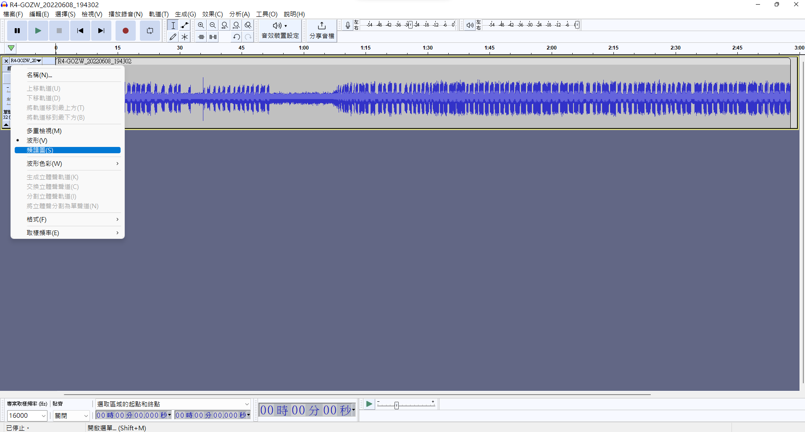
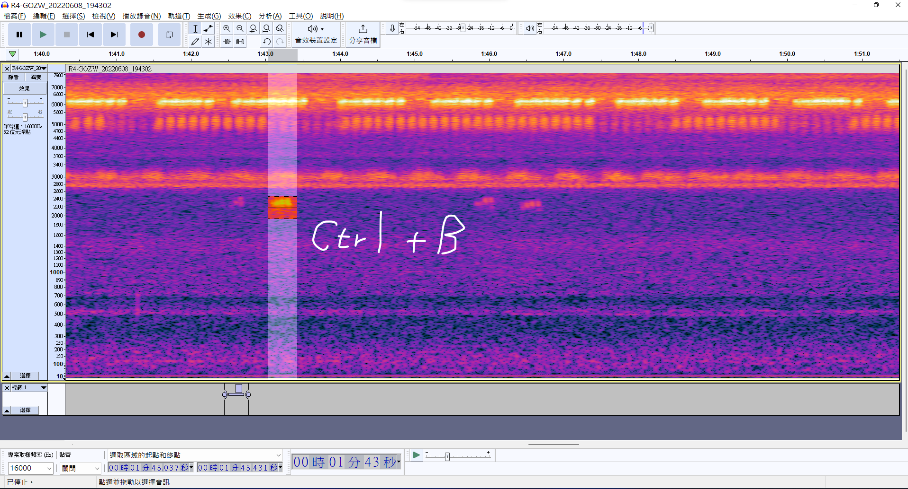
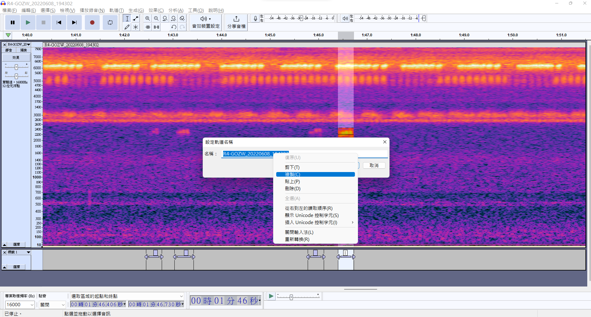
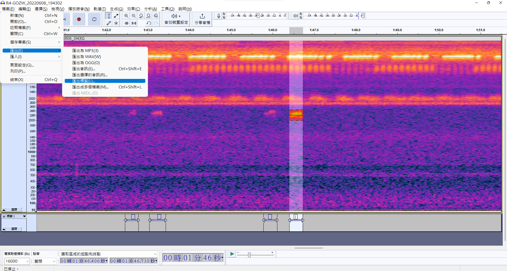
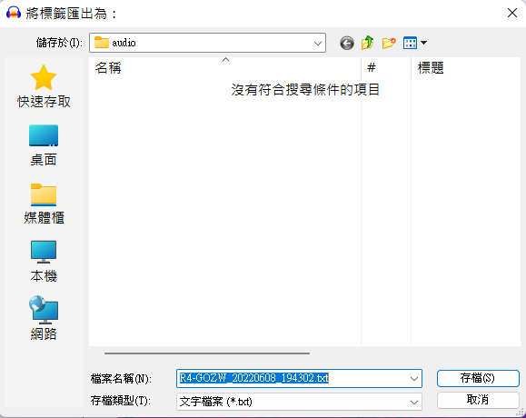
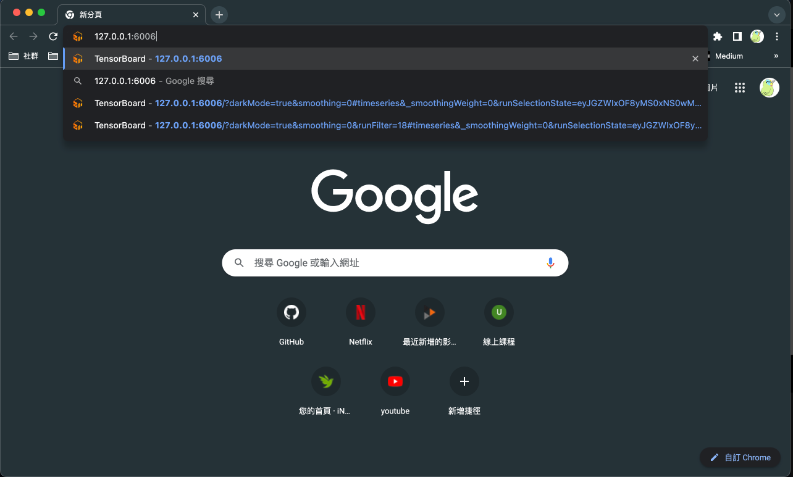
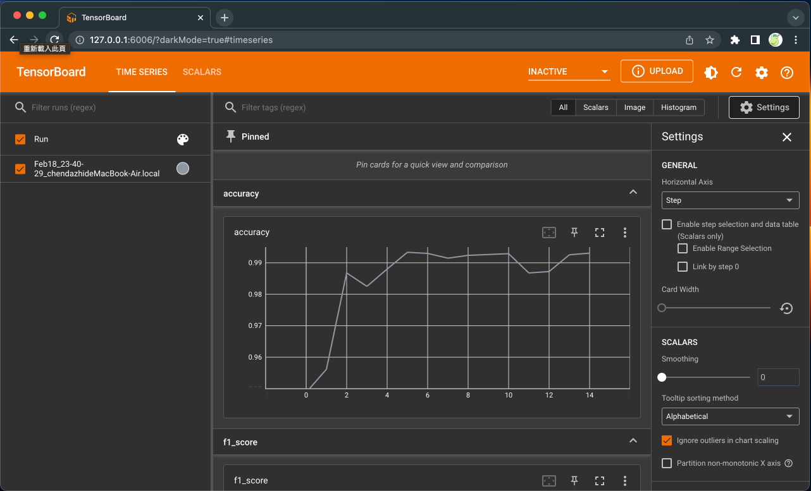
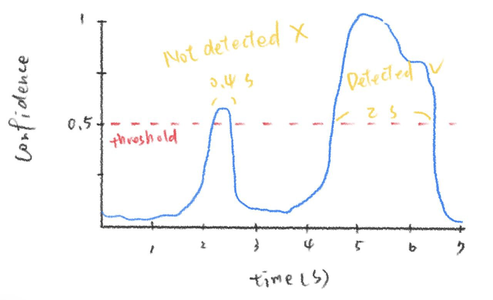

# Go Go Owl Ranger

A simple tool for training your custom audio samples and predicting base on CRNN architecture. It can predict probabiliy squences from each single window of spectrogram. It is suitable for detecting certain target signal from passive acoustic monitoring.

Logo was designed by [仲華](https://www.instagram.com/zhliu.art).
All of you had better go and see her [fan page](https://www.facebook.com/zhliu.art).

## Support
### 綠界科技
<a href="https://p.ecpay.com.tw/0696F33"></a>
<br>
https://p.ecpay.com.tw/0696F33

### PayPal
<!-- PayPal Logo -->
<tr><td align="center"></td></tr><tr><td align="center"><a href="https://paypal.me/tachihchen" title="tachihchen" onclick="javascript:window.open('https://www.paypal.com/tw/webapps/mpp/paypal-popup?locale.x=zh_TW','WIPaypal','toolbar=no, location=no, directories=no, status=no, menubar=no, scrollbars=yes, resizable=yes, width=1060, height=700'); return false;"></a></td></tr>
<!-- PayPal Logo -->
<br>
https://paypal.me/tachihchen

## install

Go Go Owl Ranger was developed under python 3.9.10

### git clone
Clone repo and install requirements.txt
```
git clone https://gitlab.tatsutomo.site/personal/gogo-owl-ranger.git
cd gogo-owl-ranger
```
### Package
```
pip install -r requirements.txt
```

### GPU Accelerated Computing
For GPU acceleration, please install the compatible torch package with your device. see [INSTALL PYTORCH](https://pytorch.org). Futhermore, installing [CUDA Toolkit](https://developer.nvidia.com/cuda-toolkit) correctly is also necessary.

## Documentation

### Training Custom Data

#### file structure
Create a folder under the `datasets`. Name it as any name you want. Then create the file structure as below:

```
gogo-owl-ranger
 ├ datasets
 │  └ yourcustomdataset
 │     ├ train
 │     │  ├ annotaion  # training annotation txt files here
 │     │  └ audio      # training audio wav files here
 │     └ val
 │        ├ annotaion  # validation annotation txt files here
 │        └ audio      # validation audio wav files here
 ├ train.py
...
```

#### annotation
<a href="https://www.audacityteam.org/download/"></a>
<br>
Go Go Owl Ranger eats the annotation of free, open source [Audacity](https://www.audacityteam.org/download/). Please download Audacity before tagging.

##### 1. Spectrogram Representation
Show audio as spectrogram. You also can set the spectrogram representation as default. edit -> preference -> track



##### 2. Creating Labels
select a region of target in the spectrogram and then press Ctrl + B.


##### 3. Export Labels
copy the audio file name (without extension)


go to File -> Export -> Export Labels.


use the file name we just copied as the new txt file name


Then an annotation for an audio file done!

#### training
Set the parameter in `config.py`. Set the `dataset` as the folder name of your custom dataset and the `model_name` as you want. Adjust appropriately the `epochs` and `batch_size` according to your device and dataset.

*if you don't 100% sure the consequence after adjusting any other parameter, just don't touch it*

``` python
pre_prosessing_config = {
    "file_duration": 180,  # train file duration (s). Please set this as the duration of longest file in your train .wav files.
}


training_config = {
    "epochs": 10,                       # number of training epoch
    "learning_rate": 0.0005,
    "batch_size": 16,
    "dataset": "<your dataset>",              # traning dataset folder name
    "skip_false_rate": 0.5,             # The probability skip the training window if all annotations are 0
    "model_name": "<your model name>",           # folder name of training outpout
}
```

Then run the `train.py`, the model with the best f1 score will be saved.

```
python3 train.py
```

<!-- #### Tensorboard

Each training result will be saved. You can run Tensorboard local to see the training log.
```
tensorboard --logdir=runs
```

Open http://127.0.0.1:6006/ in your browser.



 -->

### Detect

#### detect by python script

```python
# import GoModel class from gogoowl.py
from gogoowl import GoModel

# Model
model_path = "./models/grassowl/best.pth"

# Source path, path of file or folder
source = "./demo/grassowl_test.wav"

# load model
model = GoModel(model_path)

# set batch size and then detect
result = model.detect(source, bs=1)
```

result optput
```python
# output result info
print(result)
```
```
GoResults:
Number of files: 1
Sample rate: 16000
Audio duration: 31.008000
Number of frames per result: 1938
Frame duration (s): 0.016
Minimum Frequency: 1000
Maximum Frequency: 4000
Filenames: ['grassowl_test.wav']
```


```python
# output the original probabilities of each frame
print(result.probs)
```
```
{
    "grassowl_test.wav": [0.11526045203208923, 0.07471653819084167, 0.05118647962808609, 0.04106803983449936, 0.006243404000997543, 0.0013950413558632135, 0.0008906798320822418, 0.0008296053856611252, 0.0009863675804808736, ...]
}
```

```python
# output the original probabilities of each frame
print(result.events(conf=0.5, min_duration=0.05))
```
```
{
    "grassowl_test.wav": [[0.688, 0.912, 0.7303], [1.28, 1.52, 0.7321], [2.448, 2.672, 0.6947], [3.568, 3.84, 0.9058], [4.848, 5.072, 0.9484], ...]
}
```

```python
# output the original probabilities of each frame
print(result.pandas(conf=0.5, min_duration=0.05))
```
```
   start_time end_time confidence           filename
0       0.688    0.912     0.7303  grassowl_test.wav
1        1.28     1.52     0.7321  grassowl_test.wav
2       2.448    2.672     0.6947  grassowl_test.wav
3       3.568     3.84     0.9058  grassowl_test.wav
4       4.848    5.072     0.9484  grassowl_test.wav
5       5.296    5.648     0.9508  grassowl_test.wav
...

```

#### by detect.py
```
python3 detect.py -m models/yourmodel/best.pth -s path/to/your/data
```

| argument           | abbreviation | default | require | description |
| -------------      | ------------ | ------- | ------- | ----------- |
| `--model`          | `-m`         |         | true    | model path  |
| `--source`         | `-s`         |         | true    | target wav file or folder |
| `--batch`          | `-b`         | 1       |         | batch size  |
| `--min-duration`   | `-md`        | 0.05    |         | only all confidences are greater that threshold and duration longer than this parameter will be regarded as detected target sound event |
| `--threshold`      | `-t`         | 0.5     |         | probability threshold of presence or absence of target sound, range 0 ~ 1 |

results will be saved in the folder of source files.

#### min duration and threshold

suppose that the threshold and min duration were set as 0.5 and 0.5 respectively. the event duration less than 0.5s will not be regarded as detected.

